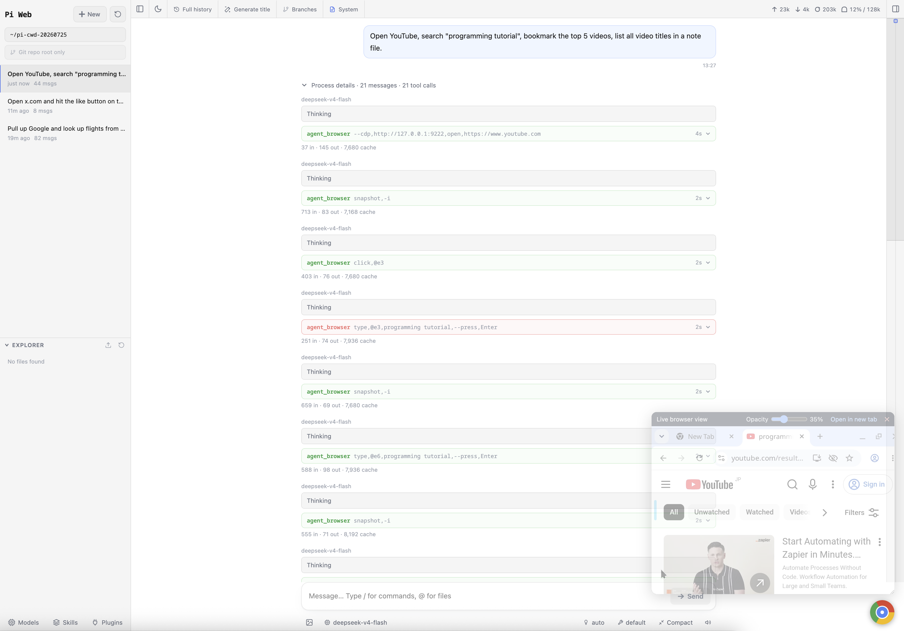

# pi-chrome-bot

A Docker Compose stack that pairs the **[Pi](https://pi.dev)** coding agent with **[pi-web](https://github.com/agegr/pi-web)** (`@agegr/pi-web`) as the main browser UX, plus a live **Chromium** for automation via CDP (`agent-browser` + `pi-agent-browser-native`). Prompt scheduling comes from **[pi-schedule-prompt](https://github.com/tintinweb/pi-schedule-prompt)**.

```
Browser tab → https://<host>:30141  pi-web + embedded live Chromium desktop
```

> Replace `<host>` with `localhost` if running locally, or with your server's IP / hostname for remote access.



## Quick deploy (pre-built image)

```bash
mkdir pi-chrome-bot && cd pi-chrome-bot
curl -fsSL -O https://raw.githubusercontent.com/ZhxChen/pi-chrome-bot/main/docker-compose.yml
docker compose up -d
```

On first start, `pi` auto-generates a self-signed certificate into `./data/proxy` for `PUBLIC_HOST` (default `localhost`). Open `https://<host>:30141` and trust that certificate once. Configure your LLM provider in the Web UI (Models / Auth).

pi-web shows a floating button (bottom-right) that opens a draggable panel embedding the live Chromium desktop. Both pages use the same HTTPS origin, so trusting the main page certificate also lets the iframe load without a second certificate prompt.

| URL | What you get |
|-----|--------------|
| `https://<host>:30141` | **pi-web** and live Chromium desktop |
| `https://<host>:30141/__pcb/vnc/` | Live Chromium desktop in its own tab |

**Requirements:** Docker with Compose v2. Image: `ghcr.io/zhxchen/pi-chrome-bot:latest`.

```bash
docker compose pull && docker compose up -d
```

---

## Architecture

```
host
├─ :30141 ─► chrome netns :8443 (TLS, nginx runs inside pi)
│              ├─ /              → 127.0.0.1:30141 (pi-web + widget)
│              └─ /__pcb/vnc/    → 127.0.0.1:3000 (Selkies)
└─ internal only
               ├─ Chromium DevTools :9222 (loopback)
               └─ agent-browser ──► http://127.0.0.1:9222 (direct connect)
```

`pi` runs with `network_mode: service:chrome`, sharing Chrome's network namespace. Its nginx terminates TLS and is the only public ingress. `agent-browser` connects straight to Chromium's DevTools loopback at `http://127.0.0.1:9222` — no proxy rewriting needed, since pi and chrome are in the same netns. Because pi shares Chrome's network namespace, Docker requires host port mappings to be declared on `chrome`, but every published target is an Nginx listener running inside `pi`.

`@agegr/pi-web` ships as a prebuilt npm package (`.next` artifacts), so nginx rewrites its HTML body (`sub_filter`) to inject a floating button + panel without patching the package. The panel loads `/__pcb/vnc/` from the same origin; Nginx strips this prefix and proxies Selkies over container-local HTTP.

**Closing the pi-web browser tab does not kill the agent** — sessions live in the `pi-web` server process. Re-open `:30141` to continue.

## Quick start (from source)

```bash
make build
make up
open https://localhost:30141
```

### Migrating from pi-webui (firstpick)

If you previously ran `@firstpick/pi-package-webui`, drop the named volume once so global CLIs match the new image:

```bash
docker compose -f docker-compose.dev.yml stop pi
docker compose -f docker-compose.dev.yml rm -f pi
docker volume rm pi-chrome-bot_npm_global
make build && make up
```

### First-time login

Provider credentials are **not** baked into the image. Configure them through **pi-web** Models/Auth. Credentials persist under `./data/app` (`~/.pi`).

## Usage

Once authenticated, ask the agent to drive Chromium through the embedded desktop via `agent_browser` (CDP attach to `http://127.0.0.1:9222`). Do not launch a second headless Chrome inside the pi container.

### Scheduled prompts

`pi-schedule-prompt` adds a `schedule_prompt` tool, so the agent can defer or
repeat its own prompts — "remind me to check this in 20 minutes", "re-check
that page every 5 minutes". Jobs persist to `<cwd>/.pi/schedule-prompts.json`
under `./data/app`.

Two limits worth knowing before you rely on it:

- **Nothing is queued.** A job fires only while its Pi session is alive in the
  `pi-web` process, and pi-web destroys a session after ~10 minutes idle. Short
  intervals keep themselves alive; a "tomorrow 9am" cron usually will not
  survive to fire. Restarting the `pi` container drops all live sessions.
- **Cron takes six fields**, seconds first: `0 * * * * *` is every minute.
  Hours follow the container `TZ` (`Asia/Shanghai` in the shipped Compose files).

A job with a `model` set runs in a fresh subagent session that loads no
extensions, so `agent_browser` is absent unless the job also passes
`extensions: ["agent-browser"]`. Scheduled browser work drives the same
Chromium you are watching.

## Make targets

| Command | Description |
|---------|-------------|
| `make build` | Build the pi image |
| `make up` | Start all services |
| `make down` | Stop all services |
| `make logs` | Tail logs |
| `make ps` | Show containers |
| `make shell` | Shell in pi |
| `make smoke` | Smoke test → `tmp/smoke.log` |
| `make clean` | down -v + remove local image |

## Configuration

| Setting | Default | Where |
|---------|---------|-------|
| Node | `24.18.0` | `build.args.NODE_VERSION` |
| pi | `0.82.1` | `build.args.PI_VERSION` |
| agent-browser | `0.33.0` | `build.args.AGENT_BROWSER_VERSION` |
| pi-agent-browser-native | latest at image build | pi package install |
| pi-schedule-prompt | latest at image build | pi package install |
| **@agegr/pi-web** | **`0.8.1`** | `build.args.PI_WEB_VERSION` |
| Public pi-web port | `30141` (HTTPS) | proxy port mapping |

### TLS certificate

`pi` needs `data/proxy/cert.pem` and `data/proxy/key.pem`. If either is
missing on startup, it mints and then reuses a self-signed certificate for
`localhost`:

```bash
docker compose up -d
```

To generate a self-signed certificate for a LAN IP or DNS name instead, edit
the `pi.environment` section of the Compose file and uncomment the
`PUBLIC_HOST` entry, replacing its value with the intended host. Delete the
existing generated files before recreating `pi`:

```yaml
environment:
  - PUBLIC_HOST=pi-bot.lan
```

```bash
rm -f data/proxy/cert.pem data/proxy/key.pem
docker compose up -d --force-recreate pi
```

Existing files are never overwritten automatically (so browsers only need to
trust the cert once).

### Use your own certificate

To use a certificate issued by a public or internal CA, place its PEM files in
the mounted `data/proxy` directory. The certificate must cover the hostname
used in the browser URL. Use the **full certificate chain** for `cert.pem` and
an unencrypted PEM private key for `key.pem`:

```bash
mkdir -p data/proxy
install -m 644 /path/to/fullchain.pem data/proxy/cert.pem
install -m 600 /path/to/privkey.pem data/proxy/key.pem
docker compose up -d --force-recreate pi
```

For a later renewal, replace both files and restart `pi`:

```bash
install -m 644 /path/to/new-fullchain.pem data/proxy/cert.pem
install -m 600 /path/to/new-privkey.pem data/proxy/key.pem
docker compose restart pi
```

`data/` is gitignored; keep the private key out of source control and restrict
host-level access to it. When using a supplied certificate, `PUBLIC_HOST` is
not needed because nginx serves the supplied files unchanged.

### Updating packages

**Rebuild (pinned versions):** bump build args, then:

```bash
make build
docker compose -f docker-compose.dev.yml stop pi
docker compose -f docker-compose.dev.yml rm -f pi
docker volume rm pi-chrome-bot_npm_global   # pick up new image CLIs
make up
```

**In-container (persists via `npm_global`):**

```bash
docker compose exec pi npm update -g @agegr/pi-web agent-browser @earendil-works/pi-coding-agent
# or: docker compose exec pi pi update --self
docker compose restart pi
```

## Data persistence

| Volume | Path | Contents |
|--------|------|---------|
| `./data/app` | `/root` | `~/.pi` credentials, sessions, packages, scheduled jobs |
| `./data/chrome` | `/config` | Chromium profile |
| `./data/proxy` | `/etc/nginx/certs` | TLS certificate and private key |
| `npm_global` | `/opt/npm-global` | Global CLIs: `pi`, `agent-browser`, `pi-web` |

## Security notes

- Host ports bind to `0.0.0.0` by default. To make the service local-only,
  change the Compose port mapping to `127.0.0.1:30141:8443`; otherwise place
  it behind a VPN or an authenticated reverse proxy.
- Do not map host `:9222` (Chromium DevTools), `:3000`, or Chromium's native `:3001`.
- The HTTPS proxy exposes agent and desktop control; do not expose it to
  untrusted networks without strong access control.

## License

[MIT](LICENSE)
